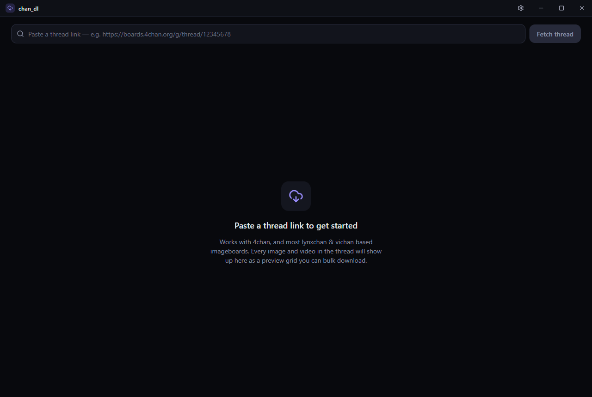

# Channex Downloader

A modern, cross-platform desktop app for browsing and bulk-downloading media from imageboard threads. Paste a thread link, preview every image and video in a thumbnail grid, and download exactly what you want — all in one click.

Built with [Tauri](https://tauri.app) (Rust) + React + TypeScript + Tailwind CSS.

## Screenshots

**Paste a link and get started**



**Full thumbnail grid with selection and bulk download**


**Settings — pick your imageboard, download folder, and concurrency**


## Features

- **Paste a thread link** from 4chan, or most lynxchan (8chan.moe, 8chan.se) and vichan-based imageboards
- **Thumbnail grid preview** of every image and video in the thread, with filename, size, and dimensions
- **Filter and search** by image/video, or by filename
- **Select individual files, select all, or select none** — then **Download selected** or **Download all** with one click
- **Concurrent downloads** with live per-file and overall progress, and the ability to cancel mid-download
- **Organized downloads**: every thread is saved to its own folder, structured as `/{board}/{timestamp}_{board}_{threadId}/`, so nothing overwrites or gets mixed together
- **Settings panel**: pick a preferred imageboard (with a quick "open site" shortcut), choose your default download folder, and set download concurrency — all persisted between launches
- Custom-drawn titlebar and window chrome, with fade-in/fade-out transitions and animated UI throughout
- All network requests happen in the Rust backend (not the webview), avoiding CORS issues across arbitrary imageboard domains

## How to install

Pre-built binaries for every release are published on the [GitHub Releases](https://github.com/niruxx/imageboard-dl/releases) page. Grab the file that matches your OS/distro from the latest release and follow the instructions below.

### Linux

**Debian / Ubuntu (`.deb`)**

```sh
sudo apt install ./channex-downloader_<version>_amd64.deb
```

**Fedora / RHEL / openSUSE (`.rpm`)**

```sh
sudo dnf install ./channex-downloader-<version>-1.x86_64.rpm
```

**Arch Linux (AUR)**

A [`PKGBUILD`](PKGBUILD) is included in this repo for the `channex-downloader-bin` package, which installs the AppImage from the latest GitHub release. Once published to the AUR:

```sh
yay -S channex-downloader-bin
```

Or build it manually from the `PKGBUILD` in this repo:

```sh
curl -O https://raw.githubusercontent.com/niruxx/imageboard-dl/main/PKGBUILD
makepkg -si
```

**Any distro (AppImage)**

```sh
chmod +x channex-downloader_<version>_amd64.AppImage
./channex-downloader_<version>_amd64.AppImage
```

No installation needed — the AppImage runs directly. For menu/icon integration, use a tool like [AppImageLauncher](https://github.com/TheAssassin/AppImageLauncher).

### Windows

Download the `.msi` or `.exe` (NSIS) installer from the latest release and run it.

### macOS

Download the `.dmg` from the latest release, open it, and drag `Channex Downloader.app` into `Applications`.

## Requirements

To **run a built release**, you only need the app itself — see [OS support](#os-support) below for platform-specific runtime requirements.

To **build from source**, you'll need:

| Tool | Version | Notes |
|---|---|---|
| [Node.js](https://nodejs.org/) | 18 or newer | includes `npm` |
| [Rust](https://www.rust-lang.org/tools/install) | stable toolchain (via `rustup`) | |
| [Tauri CLI prerequisites](https://tauri.app/start/prerequisites/) | — | platform-specific system packages, see below |

### Platform-specific build dependencies

- **Windows**: [Microsoft C++ Build Tools](https://visualstudio.microsoft.com/visual-cpp-build-tools/) (the "Desktop development with C++" workload) and the [WebView2](https://developer.microsoft.com/microsoft-edge/webview2/) runtime (preinstalled on Windows 11 and most up-to-date Windows 10 systems).
- **macOS**: Xcode Command Line Tools (`xcode-select --install`).
- **Linux**: `webkit2gtk`, `libayatana-appindicator3`, and related build packages — see the [Tauri Linux prerequisites](https://tauri.app/start/prerequisites/#linux) for your distro's exact package names.

## OS support

Channex Downloader is built on Tauri and targets:

- **Windows** 10/11 (x64) — primary development/testing platform for this app
- **macOS** 11+ (Intel and Apple Silicon)
- **Linux** — most modern distros with WebKitGTK (Debian/Ubuntu, Fedora, Arch, etc.)

`tauri build` produces the appropriate native installer for whichever OS you build on (MSI/NSIS on Windows, `.dmg`/`.app` on macOS, `.deb`/`.rpm`/AppImage on Linux).

## Building and running

Clone the repo, then install dependencies:

```sh
npm install
```

### Run in development mode

Starts the Vite dev server and launches the app with hot-reload:

```sh
npm run tauri dev
```

### Build a release binary/installer

```sh
npm run tauri build
```

The compiled app and platform installer will be under `src-tauri/target/release/` (and `src-tauri/target/release/bundle/` for the installer packages).

## Project structure

- `src/` — React + TypeScript frontend (UI, Zustand store, Tauri API bindings)
- `src-tauri/src/` — Rust backend
  - `chan/` — thread-fetching logic per imageboard engine (4chan, lynxchan, vichan)
  - `downloader.rs` — concurrent file downloader with progress events
  - `settings.rs` — persisted user settings
