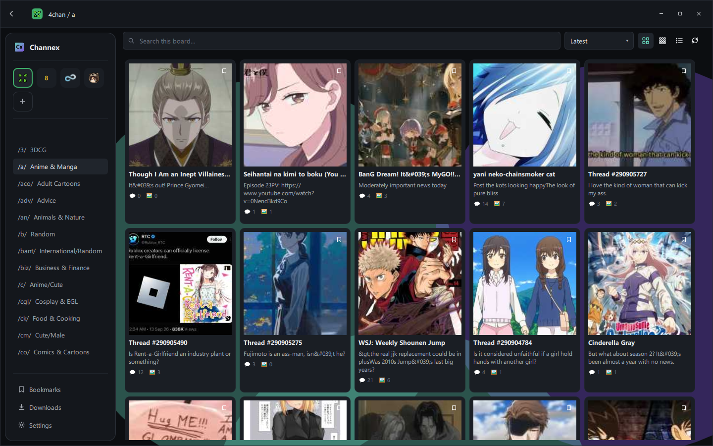
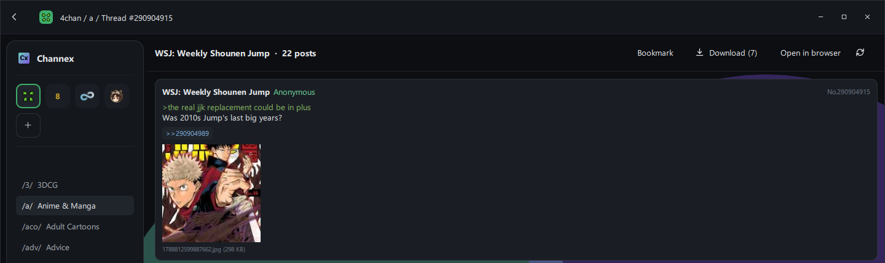
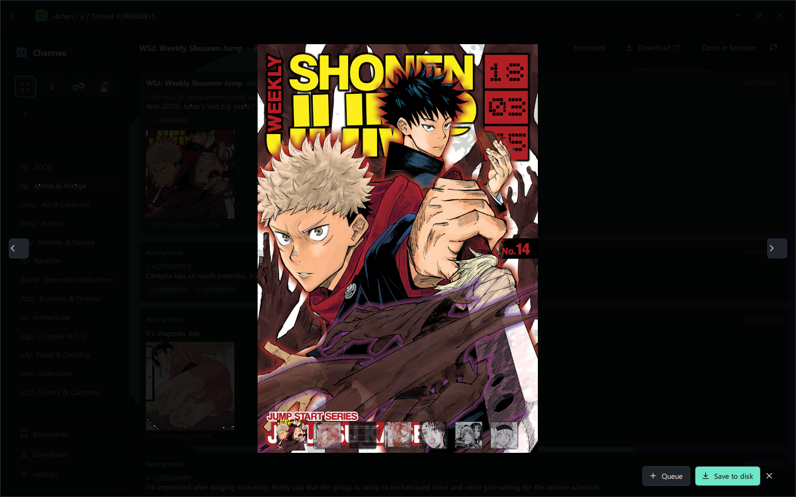
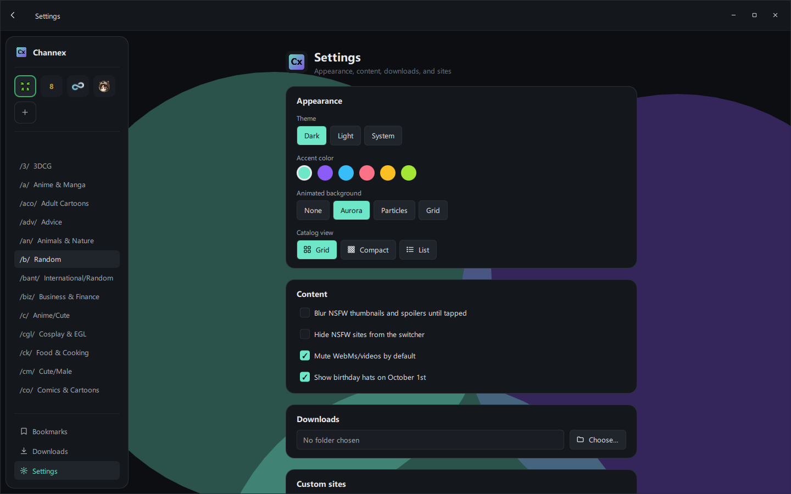

# Channex

A native **Qt6 / C++ / QML** desktop viewer for chan-style imageboards
(4chan, 8kun, 8chan.moe, Lainchan, and other 4chan-API-compatible or
LynxChan-based sites). This is a from-scratch rebuild of an earlier
Tauri + React version of the same app — that version is preserved,
unmaintained, under [`Legacy_Tauri_Builds/`](Legacy_Tauri_Builds/) for
reference. This directory (the repo root) is now the active project.

## Screenshots

| Catalog | Thread |
|---|---|
|  |  |

| Lightbox | Settings |
|---|---|
|  |  |

## Demo video

Removed. The recording used to demo the catalog/thread/lightbox flow
happened to capture a piece of NSFW content from a live board while
scrolling, which wasn't caught before the file was committed — it's
been deleted and won't be replaced with another repo-hosted recording.

## Features

- Site switching across 4 presets (4chan, 8kun, 8chan.moe, Lainchan)
  plus adding/removing custom sites, persisted to disk.
- Board discovery per site with fallback to built-in default boards.
- Catalog view (grid/compact/list, animated switch between them), live
  search, 4 sort modes with stickies pinned first, NSFW/spoiler
  blur-until-tapped.
- Thread view: OP + replies, quote-link and backlink navigation, a
  "Download" button that opens a tile-grid picker to select exactly
  which files to queue.
- Media lightbox: prev/next, drag-to-swipe, click-to-zoom, a thumbnail
  filmstrip across every file in the thread (not just the current
  post's), full playback controls for video (play/pause, seek bar,
  mute), save-to-disk / queue-to-downloads.
- Download manager: 4-way concurrent worker pool, collision-safe
  filenames, session-only job list.
- Bookmarks with "new replies since last seen" tracking.
- Settings: theme (dark/light/system), accent color, animated
  background, catalog view mode, NSFW toggles, mute-by-default,
  download folder, custom site management — laid out as a centered,
  card-based page.
- First-run onboarding wizard (5 steps, skippable, replayable).
- In-app LynxChan posting (captcha fetch + multipart reply) for
  8kun/8chan.moe-style sites.
- Custom frameless window chrome with platform-correct control
  placement (macOS traffic lights left, Windows/Linux buttons right).
  Windows drags the window manually (avoids the native-move-loop
  stutter `startSystemMove()` causes there); Linux/macOS use
  `startSystemMove()` directly, which is required on Wayland (a client
  can't reposition its own window at all there - only a
  compositor-driven move works) and is already smooth on X11/macOS.

## Known parity gaps

This is under active development, not a finished 1:1 port of the old
Tauri app. Things intentionally left for later:

- **External-site reply flow has no auto-refresh.** The old Tauri app
  opened an *embedded* secondary window for CAPTCHA-gated sites (4chan,
  Lainchan) and auto-refreshed the thread when the user closed it.
  Doing that here needs `QtWebEngine` embedded in a popup, which isn't
  wired in yet — `ExternalReply` opens the system browser instead
  (comment still copied to clipboard), and the user has to hit refresh
  manually. See `src/posting/ExternalReply.h`.
- **`CommentFormatter` is a regex-based approximation of a real HTML
  sanitizer**, not a hardened parser. It's tuned against the shapes
  4chan/vichan and LynxChan actually emit.
- **No animated-background pixel parity** with the old app's CSS
  keyframes. `aurora`/`particles`/`grid` are reimplemented with
  QML-native mechanisms (drifting blurred `Rectangle`s,
  `QtQuick.Particles`, a panning `Canvas` grid).
- **No birthday hats, no favicon cascade for custom sites** — pure
  "delight" features from the old app, not ported yet.
- **Spoiler reveal-on-hover isn't replicated** in thread comment text
  (`<span class="spoiler">` becomes a static "black box" instead of a
  hover-to-reveal one) — a `Text.RichText` limitation.
- **Theme color tokens are an approximation**, not pixel-matched
  against any specific design reference.

## Building

Requires **Qt 6.5+** (Core, Gui, Qml, Quick, QuickControls2, Network,
Multimedia — plus the Qt Quick Dialogs QML module, used for the
folder-picker, which ships as part of Qt's declarative module) and
**CMake 3.21+**. Developed and tested against **Qt 6.8.3 with MSVC
2022 on Windows**; the app has no Windows-specific code (no Win32
API calls, no hardcoded paths) so it should build and run as-is on
Linux and macOS, but those platforms haven't been verified first-hand.

```sh
cmake -B build -DCMAKE_PREFIX_PATH="<path-to-your-Qt6-install>/lib/cmake"
cmake --build build --config Debug
```

Then run the built `channex_qt` (`channex_qt.exe` on Windows, under
`build/Debug/` or `build/Release/`) binary directly — on Windows, a
post-build step automatically runs `windeployqt` so the Qt DLLs and
QML plugins it needs are already sitting next to the exe.

### Windows installer

A Release build also wires up `CPack` with the NSIS generator, so a
single command turns the build into a proper installer
(`channex_qt.exe`, its Qt runtime, and the MSVC redistributable DLLs,
with a Start Menu shortcut and uninstaller). Requires
[NSIS](https://nsis.sourceforge.io/) on `PATH` (`winget install
NSIS.NSIS`):

```sh
cmake --build build --config Release
cd build && cpack -C Release
```

This produces `build/Channex-<version>-win64.exe`.

On Linux, install Qt6 via your distro's packages (e.g. on Debian/
Ubuntu: `qt6-base-dev qt6-declarative-dev qt6-multimedia-dev
qt6-quickcontrols2-dev qml6-module-qtquick-dialogs
qml6-module-qtquick-controls qml6-module-qtquick-layouts
qml6-module-qtqml-workerscript` — package names vary by distro/version)
or from Qt's own online installer, then point `CMAKE_PREFIX_PATH` at
it the same way. The frameless custom titlebar drags correctly on both
X11 and Wayland (see the note in Features above).

No CI or packaging config yet — add platform installers once the app
is further along.

## Architecture

Business logic lives entirely in C++ (`src/`); QML (`qml/`) is purely
the view layer. The core abstraction is `ChanAdapter` — a small
interface (`fetchBoards`/`fetchCatalog`/`fetchThread`/`threadWebUrl`)
with two implementations:

- `YotsubaAdapter` — 4chan's native API and the vichan/Lainchan/8kun
  family that copies its shape.
- `LynxchanAdapter` — the LynxChan API (8chan.moe/8kun-family boards).

| Domain | Files |
|---|---|
| Site adapters | `src/adapters/` |
| Sites (presets + custom) | `src/sites/SitesController.{h,cpp}` |
| Catalog | `src/catalog/CatalogController.{h,cpp}` (`QAbstractListModel`) |
| Thread | `src/thread/ThreadController.{h,cpp}` (`QAbstractListModel`) |
| Bookmarks | `src/bookmarks/BookmarksController.{h,cpp}` |
| Downloads | `src/downloads/DownloadManager.{h,cpp}` |
| Lightbox | `src/lightbox/LightboxController.{h,cpp}` + `LightboxImageProvider` |
| LynxChan posting | `src/posting/LynxchanPoster.{h,cpp}` |
| External-site reply | `src/posting/ExternalReply.{h,cpp}` |
| Navigation (router) | `src/navigation/NavigationController.{h,cpp}` |
| Settings persistence | `src/settings/SettingsManager.{h,cpp}` (`channex-qt-data.json`) |
| Icon recoloring | `src/icons/IconProvider.{h,cpp}` (feeds `qml/components/AppIcon.qml`) |

`qml/components/` holds reusable pieces (theme-aware `AppButton`,
`AppTextField`, etc., plus `AppIcon` for the monochrome SVG icon set
under `resources/icons/ui/`); `qml/views/` holds the routed top-level
views (catalog, thread, settings, ...). `Theme.qml` is a singleton
holding the color/spacing tokens every component reads from.

## AI usage disclaimer

Parts of this project (code, documentation, and/or assets) were written or assisted by AI tools. Review changes accordingly.
